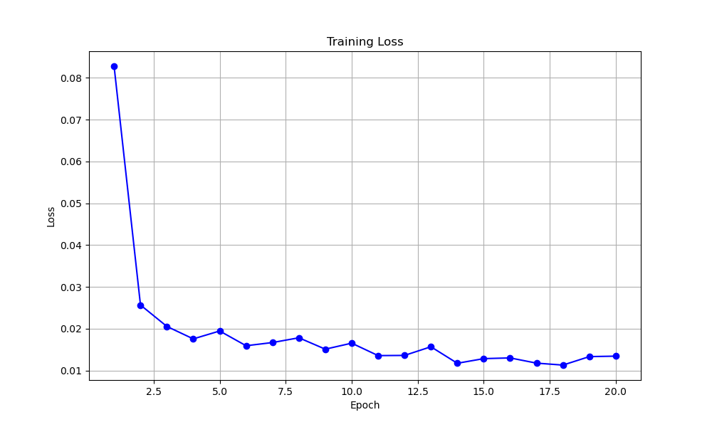

# Fashion Matching with Deep Metric Learning

## 📌 项目概述
本项目实现了一个基于深度度量学习的时尚匹配系统，能够判断两件衣服是否属于同一款式（相同类别）。系统使用三元组网络架构和三元组损失函数，通过ResNet50骨干网络提取特征，在嵌入空间中学习服装的相似性表示。

## 📂 数据集结构
数据集需要遵循以下格式：
- **图像文件命名格式**：`a_b.jpg` (或.jpeg/.png)
  - `a`：服装类别ID (同一款式服装共享相同ID)
  - `b`：任意标识符 (如视角、颜色变体等)
## 🧠 核心算法

### 1. 模型架构
```python
class FashionMatcher(nn.Module):
  def __init__(self, embedding_size=128):
      super().__init__()
      backbone = models.resnet50(pretrained=True)
      self.feature_extractor = nn.Sequential(*list(backbone.children())[:-1])
      self.embedding = nn.Sequential(
          nn.Flatten(),
          nn.Linear(2048, 512),
          nn.BatchNorm1d(512),
          nn.ReLU(),
          nn.Dropout(0.3),
          nn.Linear(512, embedding_size)
      )
```
### 2. 损失函数
```python
class OnlineTripletLoss(nn.Module):
    def forward(self, embeddings, labels):
        pairwise_dist = torch.cdist(embeddings, embeddings, p=2)
        mask_positive = labels.unsqueeze(0) == labels.unsqueeze(1)
        mask_negative = ~mask_positive
        
        hardest_positive = (pairwise_dist * mask_positive).max(dim=1)[0]
        hardest_negative = (pairwise_dist + 1e6 * mask_positive).min(dim=1)[0]
        
        losses = torch.relu(hardest_positive - hardest_negative + self.margin)
        return losses.mean()
```
## 训练运行命令
```bash
python main.py \
  --train_data ./fashion_data/train \  # 训练集路径
  --test_data ./fashion_data/test \    # 测试集路径
  --batch 64 \                        # 批大小
  --epochs 20 \                       # 训练轮数
  --model_path best_model.pth \        # 模型保存路径
  --threshold 0.85                    # 相似度阈值
```
## 推理运行命令
```bash
python main.py \
  --test_data ./fashion_data/test \
  --model_path my_model.pth \
  --eval \
  --threshold 0.85
```
## 结果展示
test包含随机的1w数据对(来自test数据集），5000same，5000diff
b-batch
e-epoch
| 训练      | test1   | test2   | test3   | test4   | test5   | mean    |
|-----------|---------|---------|---------|---------|---------|---------|
| b64-e20   |  93.4   |  94.01  |  93.79  |  94.02  |  93.94  | 93.832  |
| b64-e10   |  92.88  |  92.76  |  93.42  |  92.85  |  92.67  | 92.916  |
| b128-e10  |  92.67  |  92.52  |  92.38  |  92.69  |  92.67  | 92.586  |
| b128-e20  |  93.18  |  94.11  |  93.85  |  93.49  |  93.91  | 93.708  |
## 训练loss


